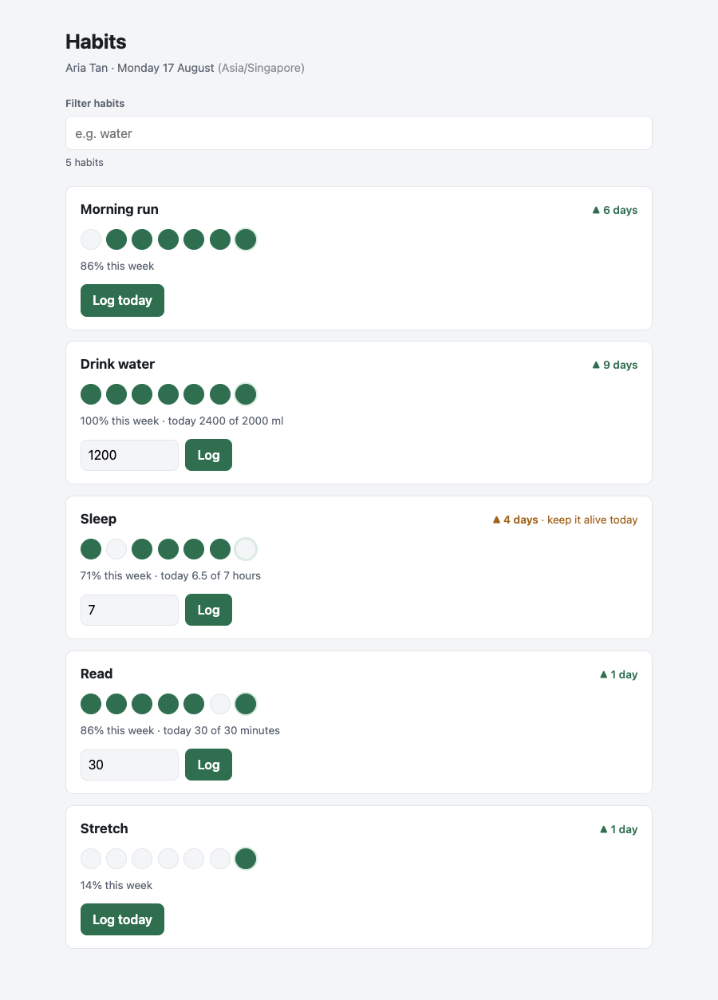

# Habit Tracker

A small habit tracking service: a Node/TypeScript API over MySQL and a React dashboard
showing each habit's current streak, its last seven days, and weekly progress. The
interesting decisions are all in two places: how a "day" is defined for a user in a
given timezone, and how two taps of the same button are allowed to interact.



## Running it

```bash
docker compose up -d
npm install
npm run dev
```

API on `:3000`, web on `:5173`. Vite proxies `/api`, so there is no CORS layer.

`npm run dev` waits for MySQL's healthcheck, applies the schema on first boot, and
seeds. `.env` is generated from `.env.example` on install, so a clean clone runs with
no manual steps and no credentials in source.

Two seeded users. Tokens are `Authorization: Bearer <token>`:

| Token | User | Timezone |
| --- | --- | --- |
| `dev-user-1` | Aria Tan | `Asia/Singapore` |
| `dev-user-2` | Miles Okafor | `America/New_York` |

The frontend uses `dev-user-1`. Change `DEV_TOKEN` in `web/src/api.ts` to see the other.

```bash
npm test              # 83 tests
npm run db:seed:force # tests truncate the database; this restores it
```

## Why MySQL

The correctness guarantee this product needs is a uniqueness constraint on
`(habit_id, local_date)`. That one key turns logging from a read-then-write that races
into a single atomic upsert, which is the difference between losing a write under
concurrent taps and not. Everything else the dashboard asks for is a relational
aggregate over a small, well shaped dataset.

A document-per-user store would trade that constraint for schema flexibility this
domain does not need. Habits have a fixed shape and they are not going to sprout
arbitrary fields.

## Data model

```
users     id, email, display_name, timezone (IANA), created_at
habits    id, user_id, name, kind, target_value, unit, aggregation, archived_at
habit_logs id, habit_id, user_id, value, local_date, logged_at
```

`habit_logs` stores **both** `local_date` and `logged_at` because they answer different
questions. `local_date` is "which day does this count towards", `logged_at` is "when did
this actually happen". Neither can be derived from the other without knowing the user's
timezone at that instant, and timezones change.

Three constraints are load bearing:

- `UNIQUE (habit_id, local_date)` gives one row per habit per day. This is what makes
  the write atomic, and it settles where aggregation happens: on write, never on read.
- `habit_logs` references `habits (id, user_id)` as a **composite** key. `user_id` is
  denormalised onto logs so ownership filtering never needs a join; the composite
  reference is what stops it drifting from `habits.user_id` and silently breaking the
  filter it exists to serve.
- `CHECK` constraints refuse a target of zero (every day would count, making streaks
  meaningless) and refuse a boolean habit using `sum` aggregation (a repeat log would
  read "2 of 1 done").

The brief's three examples are not one shape. Exercise is done or not done, water is a
daily total, sleep is a nightly reading that a later reading corrects. `kind` and
`aggregation` model that instead of flattening it into "did you do it".

## Streak semantics

Stated as a product decision, not an implementation detail:

- A **counting day** is a local date where the value **meets or exceeds** the target.
  Exactly on target counts.
- **Current streak** is consecutive counting days ending today. If today is not yet a
  counting day, the streak is measured to yesterday and flagged `atRisk`. An incomplete
  today has not broken anything, because the day is not over. Showing zero here would
  reset a user's streak at breakfast.
- If neither today nor yesterday counts, the streak is 0 and `atRisk` is **false**.
  `atRisk` means a streak you could still lose today, and there is none.
- Missing days break a streak. No grace period, no freeze.
- **Weekly progress** is counting days in the last 7 local dates, today included.

Computed in application code from 90 days of logs. At scale this becomes a
gaps-and-islands window query; the in-app version is a deliberate cut at this size.

Every date is decided server side from the user's timezone. The frontend does no date
arithmetic at all, and the one place it formats a date it pins the formatter to UTC, so
the browser's own timezone cannot shift a day the server already decided.

## Assumptions and edge cases

**Handled.** Repeat logs on one day combined per the habit's rule. Concurrent duplicate
submissions collapsing to one row (verified: ten simultaneous writes, one row, correct
total). Users outside UTC, and two users on different calendar dates at the same
instant. DST transitions in the seven day window. Backfill within 30 days. Habits with
no logs, and users with no habits. Ownership enforced in the query.

**Knowingly not handled.**

- **Value-level de-duplication.** The unique key guarantees one *row*, not one *value*.
  For a summing habit a retried request adds again, because the database cannot know
  whether that meant "I drank again" or "my phone retried". Telling those apart needs a
  client supplied `Idempotency-Key`. The endpoint is row-idempotent, not
  value-idempotent, and the tests say so explicitly.
- **Users changing timezone.** Existing `local_date` values are not rewritten. That is a
  product decision someone should make, not a bug to fix quietly.
- Raw per-reading history. We store the daily rollup, trading the audit trail for the
  uniqueness constraint above.
- Archived-habit UI, pagination, log deletion, aggregations beyond sum and last,
  offline use.

## Production gap

Real auth (the middleware is the seam; it publishes `req.user` and no route reads an
identity from anywhere else, so it is a one file swap). `Idempotency-Key` on the log
endpoint. A migration tool instead of init-mounted SQL. A separate test database:
integration tests currently truncate the development one. Rate limiting, `helmet`, a
CORS allow-list. Connection pool and index tuning, and the streak window query. An audit
trail for health data access, and secrets from a manager rather than `.env`.

`TIMESTAMP` columns cap out in 2038. Fine here, worth knowing.

## Time spent

Roughly five hours.

| Phase | Time |
| --- | --- |
| Scaffold, Docker, health check | 35m |
| Schema and seed | 35m |
| Middleware (auth, validation, errors, logging) | 40m |
| Endpoints | 65m |
| Tests | 40m |
| Frontend | 60m |
| README | 20m |

Cut: log deletion endpoint, a habit creation UI, a shared types package (the frontend
mirrors the API's DTOs by hand), and an isolated test database.

## AI tools

Claude, for scaffolding and for a first pass on each phase, then reviewed and corrected
file by file. Three specific overrides worth naming.

**The database driver defaults were wrong in a way that would not have shown up until
demo day.** `mysql2` hydrates `DATE` into a JS `Date` at the *Node process* timezone, so
`local_date` came back as `2026-08-16T16:00:00.000Z` for a row storing 17 August: the
exact off-by-one the column exists to prevent. It also returns `DECIMAL` as a string, so
`value >= target_value` was a lexicographic comparison where `"9.00" >= "10.00"` is
true, silently marking a habit at 9 of 10 as complete. Both fixed in the pool config,
with comments, and covered by a test pinning the boundary.

**The healthcheck was checking nothing.** The first version used `mysqladmin ping`,
which is the common choice. It exits 0 even on access denied, so it reported healthy
before the seeded user existed. It also needed `CMD-SHELL` rather than `CMD`, or the
password variable was passed through as a literal string. Replaced with a real query as
the application user against the application database.

**A generated date walk lost a day twice a year.** Subtracting 86,400,000ms per step is
the obvious way to build the seven day window and it is wrong intermittently. Asking for
the five days ending 2026-03-09 in New York from a midnight anchor yields 4, 5, 6, 7, 9
March: the window shifts and 8 March, a 23 hour day, disappears, so a streak sees a gap
that never happened. From a 09:00 anchor the same code is correct, which is why it
survives casual testing. All calendar arithmetic is now anchored in UTC, which has no
DST, and there is a test for it.
